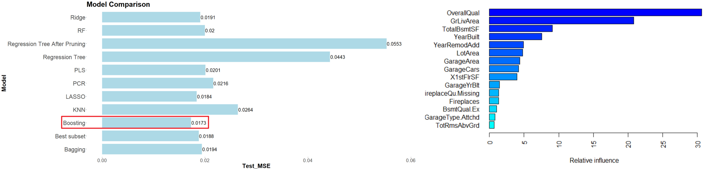

# Portfolio
---
## Data Analytics 

[**Best Model to Predict House Prices in Ames, Iowa**](https://github.com/jennifernguyen281/Kaggle-Competition-Predict-Final-Price-of-Residential-Homes-in-Ames-IA)

 We want to predict house sale prices in Ames,IA using 80 housing features and to identify features that have the most influence on house sale price. The best model could be used by realtors and buyers to estimate price for a house with specific features that they want to sell/buy.
 
We applied 11 regression algorithms from linear to non-linear techniques, from parametric to non-parametric techniques. We conclude that the best model is the Gradient Boosting model with a test MSE of 0.0173. Four most important predictors are `Overall material and finish quality`, `Above grade (ground) living area square feet`, `Total square feet of basement area`, and `Original construction date`.
 
Models: Best subset selection, LASSO, Ridge Regression, PCR, PLS, KNN, Regression Tree, Random Forest, Bagging, Boosting
 

---
[**Forecast I-94 Westbound Traffic Volume for MN DoT ATR Station 301**](https://github.com/jennifernguyen281/Forecast-Daily-Interstate-94-Westbound-Traffic-Volume-for-MN-DoT-ATR-Station-301)

[]

 The purpose of this project is to model the relationship between daily traffic volume and time as well as between daily traffic volume and different weather conditions. Study results can be used to generate strategies, such as increasing tolls on specific weekdays, to alleviate traffic jams and help reduce car emissions.
 
  
We developed univariate deterministic & stochastic time series models and multivariate models (transfer function models). Predictors used in TF models are `Average temperature`, `Amount of rain`, and `Average percentage of cloud cover`. The best performing model achieves a test MAPE of 14.74.
 
Some interesting findings: 1) Traffic volume is affected by the Average percentage of cloud cover; 2) Friday is the busiest day of the week; 3) Holidays are less busy than non-holidays.
 
Models: Seasonal Dummies, Cyclical trend model, Error model, seasonal ARIMA, TF model
 

---

